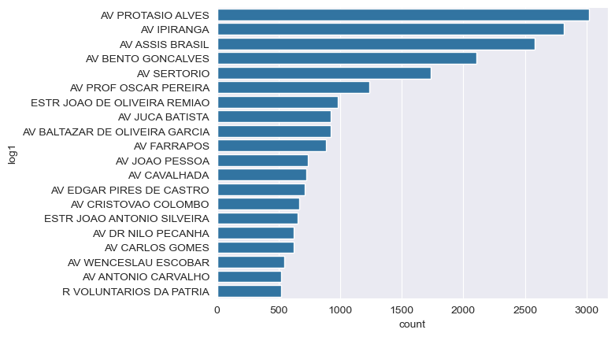
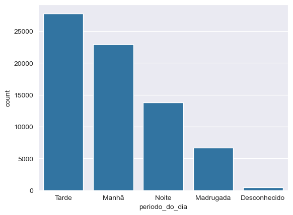

```python
import seaborn as sns
import pandas as pd
```

## Cria o frame do pandas com os dados do CSV


```python
acid = pd.read_csv('./data/cat_acidentes.csv', sep=';')
```


```python
acid.head()
```


<div>
<style scoped>
    .dataframe tbody tr th:only-of-type {
        vertical-align: middle;
    }

    .dataframe tbody tr th {
        vertical-align: top;
    }

    .dataframe thead th {
        text-align: right;
    }
</style>
<table border="1" class="dataframe">
  <thead>
    <tr style="text-align: right;">
      <th></th>
      <th>data_extracao</th>
      <th>predial1</th>
      <th>queda_arr</th>
      <th>data</th>
      <th>feridos</th>
      <th>feridos_gr</th>
      <th>mortes</th>
      <th>morte_post</th>
      <th>fatais</th>
      <th>auto</th>
      <th>...</th>
      <th>longitude</th>
      <th>latitude</th>
      <th>log1</th>
      <th>log2</th>
      <th>tipo_acid</th>
      <th>dia_sem</th>
      <th>hora</th>
      <th>noite_dia</th>
      <th>regiao</th>
      <th>consorcio</th>
    </tr>
  </thead>
  <tbody>
    <tr>
      <th>0</th>
      <td>2024-08-01 01:32:25</td>
      <td>0.0</td>
      <td>0.0</td>
      <td>2020-10-17 00:00:00</td>
      <td>1</td>
      <td>0</td>
      <td>0</td>
      <td>0</td>
      <td>0</td>
      <td>3</td>
      <td>...</td>
      <td>0.0</td>
      <td>0.000000e+00</td>
      <td>R MARCOS MOREIRA</td>
      <td>R GASTON ENGLERT</td>
      <td>ABALROAMENTO</td>
      <td>SÁBADO</td>
      <td>19:00:00.0000000</td>
      <td>NOITE</td>
      <td>NORTE</td>
      <td>NaN</td>
    </tr>
    <tr>
      <th>1</th>
      <td>2024-08-01 01:32:25</td>
      <td>6699.0</td>
      <td>0.0</td>
      <td>2019-01-01 00:00:00</td>
      <td>1</td>
      <td>0</td>
      <td>0</td>
      <td>0</td>
      <td>0</td>
      <td>3</td>
      <td>...</td>
      <td>-817840587.0</td>
      <td>1.295680e+09</td>
      <td>AV ASSIS BRASIL</td>
      <td>NaN</td>
      <td>ABALROAMENTO</td>
      <td>TERÇA-FEIRA</td>
      <td>02:45:00.0000000</td>
      <td>NOITE</td>
      <td>NORTE</td>
      <td>NaN</td>
    </tr>
    <tr>
      <th>2</th>
      <td>2024-08-01 01:32:25</td>
      <td>411.0</td>
      <td>0.0</td>
      <td>2019-01-01 00:00:00</td>
      <td>1</td>
      <td>0</td>
      <td>0</td>
      <td>0</td>
      <td>0</td>
      <td>2</td>
      <td>...</td>
      <td>-826760803.0</td>
      <td>1.292030e+09</td>
      <td>R DR BARROS CASSAL</td>
      <td>NaN</td>
      <td>ABALROAMENTO</td>
      <td>TERÇA-FEIRA</td>
      <td>07:36:00.0000000</td>
      <td>DIA</td>
      <td>CENTRO</td>
      <td>NaN</td>
    </tr>
    <tr>
      <th>3</th>
      <td>2024-08-01 01:32:25</td>
      <td>1500.0</td>
      <td>0.0</td>
      <td>2019-01-01 00:00:00</td>
      <td>4</td>
      <td>2</td>
      <td>0</td>
      <td>0</td>
      <td>0</td>
      <td>1</td>
      <td>...</td>
      <td>-827227451.0</td>
      <td>1.285404e+09</td>
      <td>AV FABIO ARAUJO SANTOS</td>
      <td>NaN</td>
      <td>CHOQUE</td>
      <td>TERÇA-FEIRA</td>
      <td>16:50:00.0000000</td>
      <td>DIA</td>
      <td>SUL</td>
      <td>NaN</td>
    </tr>
    <tr>
      <th>4</th>
      <td>2024-08-01 01:32:25</td>
      <td>8799.0</td>
      <td>0.0</td>
      <td>2019-01-01 00:00:00</td>
      <td>5</td>
      <td>0</td>
      <td>0</td>
      <td>0</td>
      <td>0</td>
      <td>3</td>
      <td>...</td>
      <td>-820146494.0</td>
      <td>1.288712e+09</td>
      <td>AV IPIRANGA</td>
      <td>NaN</td>
      <td>COLISÃO</td>
      <td>TERÇA-FEIRA</td>
      <td>19:00:00.0000000</td>
      <td>NOITE</td>
      <td>LESTE</td>
      <td>NaN</td>
    </tr>
  </tbody>
</table>
<p>5 rows × 34 columns</p>
</div>


## Conta a incidência por rua


```python
acid.log1.value_counts().head(30)
```


    log1
    AV PROTASIO ALVES                    2090
    AV IPIRANGA                          1868
    AV ASSIS BRASIL                      1731
    AV BENTO GONCALVES                   1418
    AV SERTORIO                          1121
    AV IPIRANGA                           948
    AV PROTASIO ALVES                     930
    AV PROF OSCAR PEREIRA                 905
    AV ASSIS BRASIL                       845
    ESTR JOAO DE OLIVEIRA REMIAO          744
    AV CAVALHADA                          727
    AV BENTO GONCALVES                    688
    AV JUCA BATISTA                       666
    AV BALTAZAR DE OLIVEIRA GARCIA        641
    AV SERTORIO                           615
    AV EDGAR PIRES DE CASTRO              565
    AV FARRAPOS                           546
    ESTR JOAO ANTONIO SILVEIRA            514
    AV JOAO PESSOA                        498
    AV CRISTOVAO COLOMBO                  468
    AV CARLOS GOMES                       466
    AV DR NILO PECANHA                    427
    AV WENCESLAU ESCOBAR                  411
    AV ANTONIO CARVALHO                   390
    AV CEARA                              377
    AV BORGES DE MEDEIROS                 357
    AV BERNARDINO SILVEIRA DE AMORIM      346
    AV FARRAPOS                           341
    R RAMIRO BARCELOS                     335
    AV PROF OSCAR PEREIRA                 331
    Name: count, dtype: int64


## Agrupa as ruas iguais


```python
acid.loc[:,'log1'] = acid.loc[:,'log1'].apply(lambda x: str(x).strip())
```


```python
acid.log1.value_counts().head(30)
```


    log1
    AV PROTASIO ALVES                   3020
    AV IPIRANGA                         2816
    AV ASSIS BRASIL                     2576
    AV BENTO GONCALVES                  2106
    AV SERTORIO                         1736
    AV PROF OSCAR PEREIRA               1236
    ESTR JOAO DE OLIVEIRA REMIAO         983
    AV JUCA BATISTA                      922
    AV BALTAZAR DE OLIVEIRA GARCIA       920
    AV FARRAPOS                          887
    AV JOAO PESSOA                       735
    AV CAVALHADA                         727
    AV EDGAR PIRES DE CASTRO             709
    AV CRISTOVAO COLOMBO                 670
    ESTR JOAO ANTONIO SILVEIRA           655
    AV DR NILO PECANHA                   625
    AV CARLOS GOMES                      624
    AV WENCESLAU ESCOBAR                 544
    AV ANTONIO CARVALHO                  523
    R VOLUNTARIOS DA PATRIA              523
    AV CEL APARICIO BORGES               496
    AV BORGES DE MEDEIROS                493
    AV PRESIDENTE CASTELO BRANCO         485
    AV CEARA                             479
    AV OSVALDO ARANHA                    473
    AV PLINIO BRASIL MILANO              463
    R RAMIRO BARCELOS                    453
    AV BERNARDINO SILVEIRA DE AMORIM     450
    AV NONOAI                            408
    AV OTTO NIEMEYER                     404
    Name: count, dtype: int64


## Cria uma ordenação e exibe o gráfico das ruas


```python
acid_order=acid.groupby('log1')['log1'].count().sort_values(ascending=False).iloc[0:20].index.values
sns.countplot(data=acid, y='log1', order=acid_order)
```


    <Axes: xlabel='count', ylabel='log1'>


    

    


## Exibe o gráfico do período do dia


```python
acid.head()
```


<div>
<style scoped>
    .dataframe tbody tr th:only-of-type {
        vertical-align: middle;
    }

    .dataframe tbody tr th {
        vertical-align: top;
    }

    .dataframe thead th {
        text-align: right;
    }
</style>
<table border="1" class="dataframe">
  <thead>
    <tr style="text-align: right;">
      <th></th>
      <th>data_extracao</th>
      <th>predial1</th>
      <th>queda_arr</th>
      <th>data</th>
      <th>feridos</th>
      <th>feridos_gr</th>
      <th>mortes</th>
      <th>morte_post</th>
      <th>fatais</th>
      <th>auto</th>
      <th>...</th>
      <th>longitude</th>
      <th>latitude</th>
      <th>log1</th>
      <th>log2</th>
      <th>tipo_acid</th>
      <th>dia_sem</th>
      <th>hora</th>
      <th>noite_dia</th>
      <th>regiao</th>
      <th>consorcio</th>
    </tr>
  </thead>
  <tbody>
    <tr>
      <th>0</th>
      <td>2024-08-01 01:32:25</td>
      <td>0.0</td>
      <td>0.0</td>
      <td>2020-10-17 00:00:00</td>
      <td>1</td>
      <td>0</td>
      <td>0</td>
      <td>0</td>
      <td>0</td>
      <td>3</td>
      <td>...</td>
      <td>0.0</td>
      <td>0.000000e+00</td>
      <td>R MARCOS MOREIRA</td>
      <td>R GASTON ENGLERT</td>
      <td>ABALROAMENTO</td>
      <td>SÁBADO</td>
      <td>19:00:00.0000000</td>
      <td>NOITE</td>
      <td>NORTE</td>
      <td>NaN</td>
    </tr>
    <tr>
      <th>1</th>
      <td>2024-08-01 01:32:25</td>
      <td>6699.0</td>
      <td>0.0</td>
      <td>2019-01-01 00:00:00</td>
      <td>1</td>
      <td>0</td>
      <td>0</td>
      <td>0</td>
      <td>0</td>
      <td>3</td>
      <td>...</td>
      <td>-817840587.0</td>
      <td>1.295680e+09</td>
      <td>AV ASSIS BRASIL</td>
      <td>NaN</td>
      <td>ABALROAMENTO</td>
      <td>TERÇA-FEIRA</td>
      <td>02:45:00.0000000</td>
      <td>NOITE</td>
      <td>NORTE</td>
      <td>NaN</td>
    </tr>
    <tr>
      <th>2</th>
      <td>2024-08-01 01:32:25</td>
      <td>411.0</td>
      <td>0.0</td>
      <td>2019-01-01 00:00:00</td>
      <td>1</td>
      <td>0</td>
      <td>0</td>
      <td>0</td>
      <td>0</td>
      <td>2</td>
      <td>...</td>
      <td>-826760803.0</td>
      <td>1.292030e+09</td>
      <td>R DR BARROS CASSAL</td>
      <td>NaN</td>
      <td>ABALROAMENTO</td>
      <td>TERÇA-FEIRA</td>
      <td>07:36:00.0000000</td>
      <td>DIA</td>
      <td>CENTRO</td>
      <td>NaN</td>
    </tr>
    <tr>
      <th>3</th>
      <td>2024-08-01 01:32:25</td>
      <td>1500.0</td>
      <td>0.0</td>
      <td>2019-01-01 00:00:00</td>
      <td>4</td>
      <td>2</td>
      <td>0</td>
      <td>0</td>
      <td>0</td>
      <td>1</td>
      <td>...</td>
      <td>-827227451.0</td>
      <td>1.285404e+09</td>
      <td>AV FABIO ARAUJO SANTOS</td>
      <td>NaN</td>
      <td>CHOQUE</td>
      <td>TERÇA-FEIRA</td>
      <td>16:50:00.0000000</td>
      <td>DIA</td>
      <td>SUL</td>
      <td>NaN</td>
    </tr>
    <tr>
      <th>4</th>
      <td>2024-08-01 01:32:25</td>
      <td>8799.0</td>
      <td>0.0</td>
      <td>2019-01-01 00:00:00</td>
      <td>5</td>
      <td>0</td>
      <td>0</td>
      <td>0</td>
      <td>0</td>
      <td>3</td>
      <td>...</td>
      <td>-820146494.0</td>
      <td>1.288712e+09</td>
      <td>AV IPIRANGA</td>
      <td>NaN</td>
      <td>COLISÃO</td>
      <td>TERÇA-FEIRA</td>
      <td>19:00:00.0000000</td>
      <td>NOITE</td>
      <td>LESTE</td>
      <td>NaN</td>
    </tr>
  </tbody>
</table>
<p>5 rows × 34 columns</p>
</div>


## Cria o periodo do dia


```python
# Extrair a hora como número inteiro
acid.loc[:, 'hora_int'] = pd.to_numeric(acid.hora.str[:2], errors='coerce')

# Função para categorizar períodos
def categorizar_periodo(hora):
    if pd.isnull(hora):
        return 'Desconhecido'
    elif 6 <= hora < 12:
        return 'Manhã'
    elif 12 <= hora < 18:
        return 'Tarde'
    elif 18 <= hora < 22:
        return 'Noite'
    else:
        return 'Madrugada'

# Aplicar a categorização
acid.loc[:, 'periodo_do_dia'] = acid.hora_int.apply(categorizar_periodo)
```

## Ordena e exibe o gráfico


```python
periodo_order = acid.periodo_do_dia.value_counts().index
```


```python
sns.countplot(data=acid, x='periodo_do_dia', order=periodo_order)
```


    <Axes: xlabel='periodo_do_dia', ylabel='count'>


    

    

